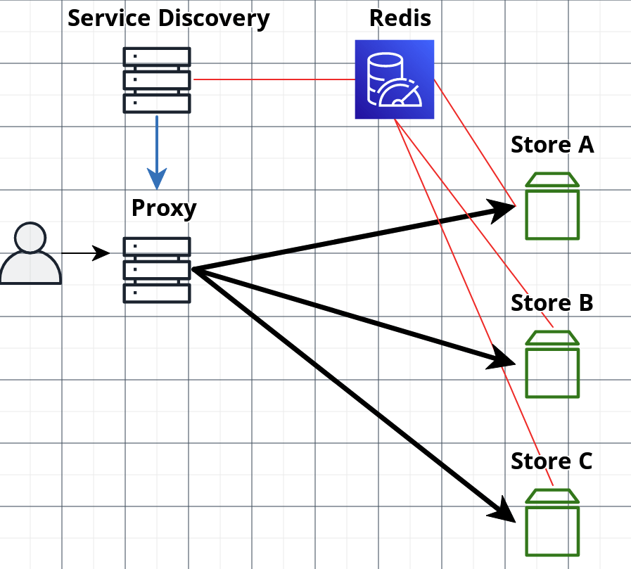
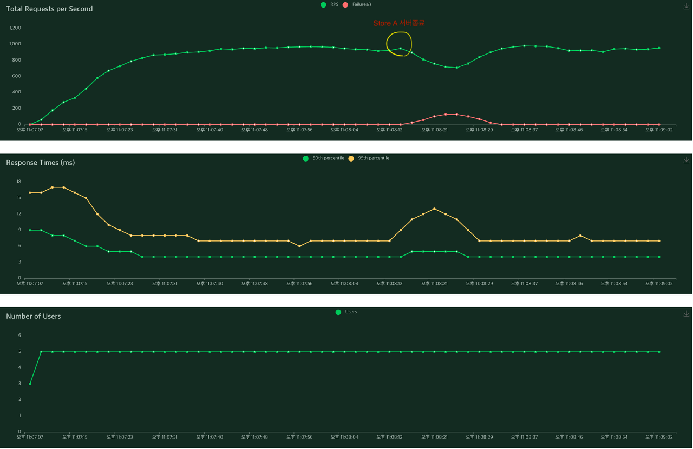

# 분산환경 Key-Value Store 프로젝트
이 프로젝트는 분산 Key-Value 저장 시스템의 장애 대응 능력을 테스트하며, 분산 시스템에서 중요한 CAP 이론과 PACELC 전략을 적용합니다.

## 목차
- [How To Run](#how-to-run)
- [시스템 구성](#시스템-구성)
- [서비스 역할](#서비스-역할)
- [장애 대응](#장애-대응)
- [PACELC 전략](#pacelc-전략)
- [적용 사례](#적용-사례)
- [실험 결과](#실험-결과)

### How To Run
```
Mac OS

만약 5000포트를 사용중이라면 기존 5000포트의 프로세스를 종료하고 실행해주세요(맥북 기존 5000포트 AirPlay) 
- kill -9 $(lsof -ti :5000)

1. 서버 실행
- ./gradlew clean build
- docker-compose build --no-cache && docker-compose up 

2. locust 실행 (부하 도구)
- pip install locust #locust 설치
- locust -f script/locustfile.py

3. locust 웹 브라우저 접속
- localhost:8089
- 설정
    - Number of total user: 10
    - Spawn rate: 1
    - host: http://localhost:9000

4. Store 서버 1개 종료
- docker kill key-value-store-store-service-1-1 
```

### 시스템 구성

- Proxy 서버 - 요청 중개자 및 데이터 라우팅 역할
- Service-Discovery 서버 - 서버 가용성 모니터링 및 알림 처리
- Store 서버 (x3) - Key-Value 데이터 저장

### 서비스 역할
- Proxy 서버 - 사용자의 요청을 받아, hash-ring을 이용해 적절한 Store 서버로 라우팅합니다.
- Service Discovery - 5초마다 Store 서버의 heart beat 상태를 모니터링합니다.
- Store 서버 - Redis로 heart beat 카운트를 1초 간격으로 업데이트합니다.

### 장애 대응
Service Discovery는 Store 서버 장애를 식별하며, 이 정보를 Proxy 서버에 전달합니다.
Proxy 서버는 장애가 발생한 Store 서버를 hashring에서 제외합니다.

### PACELC 전략
- 장애 상황 (P): 가용성 (Availability)를 최우선으로 합니다.
- 일반 상황 (E): 일관성 (Consistency)을 희생하여 지연 시간 (Latency)를 줄입니다.

### 적용 사례
본 시스템 구조는 응답 시간이 중요한 서비스로 사용자의 리뷰 서비스에 적합합니다.

### 실험 결과

Store-A 서버를 강제 종료 했을 때, 성공 응답 수가 1/3 정도 줄어들고 실패 응답 수가 1/3정도 증가합니다.

Store-A의 장애를 Service Discovery 서버가 알게되고 Proxy 서버로 hash-ring 갱신 요청을 합니다.

이후 서비스가 정상적으로 돌아옵니다.
 

